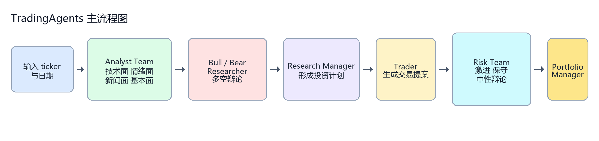
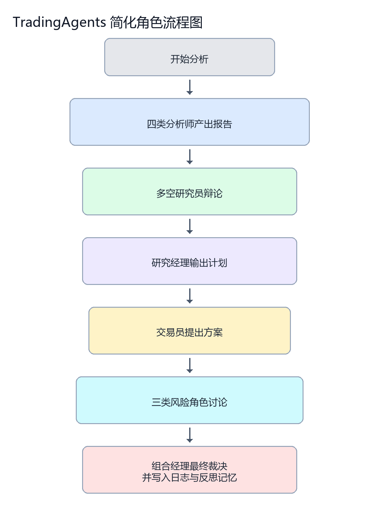
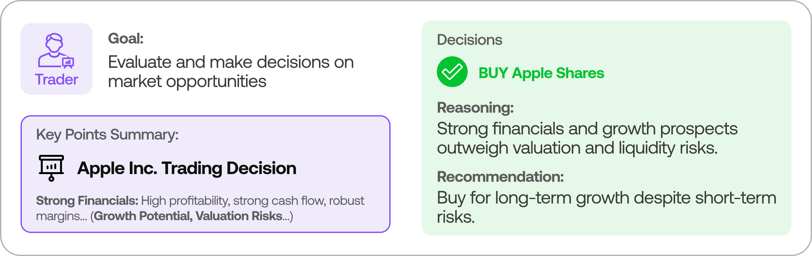
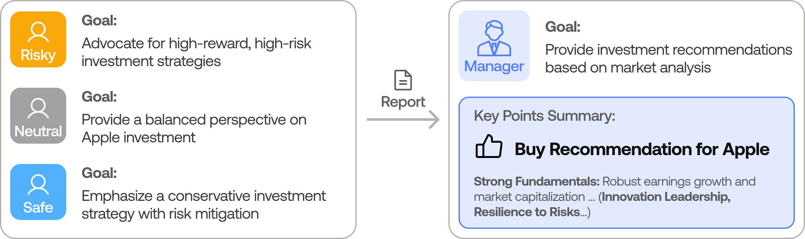

# TradingAgents 前四轮学习总结：我如何介绍和批判这个程序

## 程序主流程图

如果只用一句话概括，这个程序就是把单次股票研究拆成“证据采集 -> 观点对抗 -> 交易翻译 -> 风险审议 -> 最终裁决 -> 记忆回灌”的一条流水线。

## 一句话判断

这不是一个可以直接交付生产的交易系统，而是一套基于 LangGraph 的多智能体投研决策流水线原型。它已经具备“研究分工、观点辩论、风险审议、结果留痕与事后反思”的完整骨架，但距离可验证、可回测、可扩展、可适配 A 股的正式系统，还有一段不短的工程化距离。

---

## 我会怎么介绍这个程序

我会把 TradingAgents 定义成一套模拟投研机构内部决策流程的程序，而不是一个单纯调用大模型给出买卖建议的工具。

它把一次股票研究任务拆成多个角色：先由技术面、情绪面、新闻面、基本面四类分析师收集证据，再由多头研究员和空头研究员展开对抗式辩论，之后交给研究经理汇总为投资计划，再由交易员形成交易提案，最后进入风险团队和组合经理审议，输出最终决策。

从架构上看，它不是一个线性脚本，而是一个带共享状态、条件跳转、循环上限、检查点恢复和记忆反思能力的图式工作流。因此，这套程序更适合被理解为“AI 投研流程引擎”或“多智能体研究操作系统”，而不是一个已经完成闭环的量化交易平台。

它的价值主要不在于预测是否一定更准，而在于把原本分散、口头化、难以复盘的研究过程，变成一条可编排、可追踪、可多角色协同的决策链。

---

## 这个程序到底提供了什么

### 1. 交付的是流程，不是单点模型

这套系统最重要的资产不是某一个 prompt，也不是某一个模型，而是流程编排能力。

这个程序已经把交易研究过程拆成了几层：

1. 证据采集层：价格、技术指标、新闻、舆情、财务报表。
2. 专题分析层：Market Analyst、Sentiment Analyst、News Analyst、Fundamentals Analyst。
3. 观点冲突层：Bull Researcher 与 Bear Researcher。
4. 计划翻译层：Research Manager 与 Trader。
5. 风险审议层：Aggressive、Conservative、Neutral 三方风险辩论。
6. 最终批准层：Portfolio Manager。

这意味着系统的核心优势在于“职责拆分后再综合”，而不是“让一个大模型一次性想完全部问题”。

### 2. 交付的是研究决策流水线，不是成熟交易执行平台

它目前已经完成的，是从输入单个 ticker 和分析日期，到最终输出买入、持有或卖出建议的一整套研究链路。

但它没有原生完成以下能力：

1. 多标的组合级统一调仓。
2. 真实订单撮合。
3. 手续费、滑点、涨跌停、最小成交单位等交易制度模拟。
4. 日历驱动的系统化批量回测。
5. 组合净值、回撤、胜率、夏普等完整绩效统计。

所以从我的使用判断看，这一版更接近“研究系统原型”而不是“交易平台成品”。

---

## 这套系统长什么样

### 简化角色流程图

### 总体架构图

这张图最能说明它的设计思路：不是一个 Agent，而是一条多角色传递、辩论、裁决的链路。

### Analyst 团队

这部分负责构建证据空间。它回答的不是“该不该买”，而是“我们现在掌握了哪些事实与线索”。

### Researcher 团队

研究员团队的作用不是减少分歧，而是故意制造多空冲突，让系统在内部先发生一次认知对抗。

### Trader

交易员不是最终拍板者，而是把研究结论翻译成更接近交易桌面语言的提案，包括动作、理由、入场、止损和仓位。

### Risk 与 Portfolio Manager

这部分体现了它的一个优点：它没有把风控做成静态规则，而是做成三方立场博弈，最终由组合经理做批准或否决。

### CLI 交互界面

界面层已经能支持单次研究任务的发起、过程展示和结果浏览，说明它提供的不只是源码骨架，也包括一个可演示、可操作的使用入口。

---

## 我认为这套程序最有价值的地方

### 1. 它把“研究过程”显式化了

普通大模型投顾方案最大的问题，是结论来得快，但推理路径不稳定，也难以审计。

这套系统的价值在于，它把研究过程拆成角色、状态、节点和条件跳转。这样做的直接收益是：

1. 每个阶段的职责相对清楚。
2. 每一步产生什么报告、用了什么工具，原则上可以回溯。
3. 讨论过程不是黑箱一团，而是有结构地推进。

对我来说，这意味着它更适合作为研究辅助底座，而不是一次性答案机器。

### 2. 它已经具备初步工程化意识

从源码和文档来看，它不是只在做 demo，它已经开始处理一些真正的工程问题：

1. 用默认配置和环境变量控制模型、轮数、数据源和路径。
2. 用条件逻辑限制工具调用和辩论轮数，避免无限循环。
3. 用 checkpoint 处理中断恢复。
4. 用 memory log 记录历史决策，并在后续运行中补收益和反思。
5. 用统一数据接口屏蔽 Yahoo Finance 和 Alpha Vantage 的底层差异。

这说明它对“系统怎么长期运行”是有意识的，不只是为了跑出一张漂亮截图。

### 3. 它的数据层做了供应商解耦

Alpha Vantage 和 Yahoo Finance 在当前项目中，不是两个平行功能，而是统一数据工具的两套供应商实现。

这件事很重要，因为它意味着：

1. 上层 Agent 不需要知道底层由谁供数。
2. 当 Yahoo 被限流时，可以切 Alpha 兜底。
3. 后续如要引入 Tushare、Wind、聚宽、同花顺或内部数据服务，理论上可以沿同一抽象层扩展。

从我的角度，这种抽象方式比“把数据接口写死在 prompt 里”专业得多。

### 4. 它对 prompt 不是无意识堆砌，而是有工作流控制含义

从第三轮学习提取的 prompt 可以看出，它对提示词的使用不是简单写几句角色设定，而是把 prompt 作为流程控制的一部分：

1. 要求精确保留 ticker 后缀，避免跨市场代码错乱。
2. 强制分析师优先调用工具，而不是空想。
3. 允许某个角色回答不完整，由别的角色续上。
4. 用结构化输出约束关键中间结果和最终结果。

这说明它追求的不是“让模型会说话”，而是“让模型在流程中可控地工作”。

---

## 我必须明确指出的批判

### 1. 这是研究原型，不是闭环交易系统

这是最重要的一条。

如果有人把它描述成“交易系统”甚至“量化平台”，我会先纠偏。因为从当前实现看，它还没有解决交易系统真正最难的部分：

1. 组合层资金分配。
2. 多标的同步决策与再平衡。
3. 订单与成交模拟。
4. 交易成本和市场制度约束。
5. 稳定可复现的回测评价体系。

因此，当前最合适的定位应当是：多智能体投研与决策辅助原型。

### 2. 回测能力目前只是“轻量复盘”，不是严格回测

系统现在能做的是：

1. 选择历史日期运行一次研究。
2. 以后再运行时，补抓未来价格。
3. 计算收益和 alpha。
4. 生成一段反思文字，再写回记忆。

这当然比完全没有复盘强，但它离正式回测还差几层关键基础设施：

1. 日期批处理框架。
2. 持仓簿和调仓逻辑。
3. 费用与滑点处理。
4. 组合收益曲线和风险指标。
5. 实验参数一致性与可重复对照。

所以这套系统目前更像“研究结论的事后检查器”，不是“可以直接拿来比较策略优劣的回测引擎”。

### 3. A 股可输入，不代表 A 股可用

这一点必须说透。

从 ticker 支持上，它已经考虑了 .SZ、.SH、.HK、.T 等后缀保留，这说明它在符号层面不是只考虑美股。

但 A 股是否真正可用，不取决于能不能输入代码，而取决于以下四件事是否成立：

1. 数据源是否稳定覆盖 A 股价格、新闻、基本面与舆情。
2. 基准指数是否正确映射到沪深市场，而不是默认拿 SPY 当比较对象。
3. 研究语料是否是中文市场真实有效的消息源，而不是 Yahoo、StockTwits、Reddit 这类海外语境。
4. 交易制度是否按 A 股规则落地，而不是默认海外市场假设。

就当前版本看，这四件事都没有完整解决。因此，A 股支持更准确的说法是：代码入口初步兼容，研究与回测质量仍明显不足。

### 4. 数据底座仍然偏海外，决定了它的市场上限

当前系统的数据生态核心还是 Yahoo Finance 与 Alpha Vantage。

这两者的优点是通用、便捷、能快速搭建跨市场原型；但它们的局限也很明显：

1. 对中文市场新闻和本土舆情的覆盖不足。
2. 对 A 股财报、公告、研报、资金流、交易制度的贴合度不够。
3. 对高频限流、数据缺口、字段一致性等问题依然敏感。

这决定了系统目前最适合的场景仍然是美股或国际市场研究原型验证，而不是中国市场的严肃生产应用。

### 5. 多 Agent 设计增强了可解释性，也放大了成本和不稳定性

多角色协同的优点很明显，但我也要看到代价：

1. 节点越多，token 成本越高。
2. 路径越长，输出波动越大。
3. 上游报告质量不好时，会把噪声层层传递到下游。
4. 研究员与风控辩论轮数过多时，收益未必增加，成本却会快速上升。

所以这套架构不能只看“看起来很完整”，还必须用实验数据回答一个问题：多 Agent 相比更简化的工作流，到底增加了多少真实有效的信息增益。

如果没有这层实证，复杂度就可能大于价值。

### 6. Prompt 控制很强，但仍未解决“正确性证明”问题

它已经对 prompt、ticker 精确性、结构化输出、工具调用顺序做了不少约束，这值得肯定。

但我依然要追问：

1. 结论是否可重复。
2. 不同模型下输出是否稳定。
3. 数据缺失时是否会生成貌似合理但实际上错误的分析。
4. 结构化输出是否只是格式整齐，而不是判断真正可靠。

也就是说，工程约束可以改善可控性，但并不能自动等于策略有效性。

---

## 我对这个程序的正式定位

如果要写进汇报或说明材料，我会这样定义这套系统：

TradingAgents 是一套面向单标的研究任务的多智能体投研决策框架。它通过分析师、研究员、交易员、风险团队和组合经理等角色分工，将价格、新闻、舆情与基本面数据转化为一条可追踪、可复盘、可扩展的研究决策流程。该框架已具备流程编排、工具调用、结构化输出、检查点恢复与决策记忆等能力，适合作为 AI 投研中台或研究辅助引擎的原型基础。但按我对成熟系统的标准看，它的回测闭环、组合层能力、A 股本土化、数据底座质量和制度适配仍需补齐，暂不宜按生产级交易系统认定。

---

## 我最想追问的五个问题

### 问题一：你们证明过多 Agent 比少 Agent 更好吗

我需要看到实验，而不是只看到架构图。至少要说明：

1. 去掉 Bull/Bear 辩论后，效果下降多少。
2. 去掉风险三方辩论后，效果下降多少。
3. 不同 debate rounds 对结果和成本的影响是什么。

### 问题二：你们的回测是不是严格避免未来函数

当前代码已经对财报和新闻做了按 curr_date 过滤，这是优点。

但我仍会继续核验：

1. 所有数据源是否都一致处理了未来数据。
2. 回测日期、新闻发布日期、财报披露日期、价格可交易日期之间是否严格对齐。
3. 反思文本是否只用于未来轮次，而不会污染历史实验。

### 问题三：A 股版本的数据方案是什么

如果这个程序想落地 A 股，必须明确回答：

1. 替换哪些数据源。
2. 舆情从哪里来。
3. 公告和财报从哪里来。
4. benchmark 用什么。
5. T+1、涨跌停、印花税如何建模。

在这些问题没回答之前，A 股只能说“概念兼容”，不能说“业务可用”。

### 问题四：输出怎么验真，不是只验格式

结构化输出很好，但我更关心：

1. 结论正确率如何评估。
2. 解释质量如何评分。
3. 风险建议是否真的降低回撤。
4. 不同模型供应商切换后，行为是否偏移。

### 问题五：如果规模化跑 100 只股票，成本和吞吐怎么控制

当前系统天然是单 ticker 单日期执行。

因此一旦我要把它用在股票池上，就必须追问：

1. 单标的平均耗时。
2. 单标的平均 token 成本。
3. 数据接口限频下的并发策略。
4. 失败重试和断点恢复机制。

这些问题决定它能不能从“演示程序”走向“批量生产工具”。

---

## 我最终会给出的结论

这套程序有明显亮点，尤其是在多智能体流程设计、角色职责拆分、统一数据接口、检查点与记忆反思这些方面，已经超出了普通 Demo 的水平。

但它当前真正成熟的部分，是“把研究过程组织起来”；尚未真正成熟的部分，是“把研究结果验证并落到交易制度和组合层面”。

因此，我会把它看成一个值得继续投入的研究底座，而不是已经可以直接承担生产绩效责任的交易系统。

如果要继续合作，最合理的路线不是继续增加角色和 prompt，而是优先补三件事：

1. 严格回测框架。
2. A 股本土数据与制度适配。
3. 多标的组合层调度与评价体系。

把这三件事补起来，这套方案才可能从“看起来先进”变成“真正可验收”。

---

## 附：一句更强硬的评价

这套系统，强在研究流程设计，弱在交易闭环验证；强在多角色协同，弱在本土市场落地；强在架构可讲，弱在绩效可证。它已经是一套不错的 AI 投研原型，但还不是一套可以直接为结果负责的交易系统。

---

## 附录一：代码中主要提示词的中文翻译

下面这部分把主流程里真正送入模型的核心提示词，按角色整理成中文。为避免附录过度膨胀，我保留了原 prompt 的职责、约束、输出要求和关键字段，对超长部分做了结构化翻译。

### 1. 通用语言输出附加指令

请将你的整个回答都用 {lang} 语言输出。

### 2. 通用标的上下文指令

要分析的标的是 {ticker}。在每一次工具调用、报告和建议中都使用这个完全一致的 ticker，并保留任何交易所后缀，例如 .TO、.L、.HK、.T。

### 3. 通用协作型 system prompt

你是一个乐于助人的 AI 助手，正在与其他助手协作。请使用提供的工具推进对问题的解答。如果你无法完整回答，也没关系，其他拥有不同工具的助手会接着你的位置继续。先执行你当前能做的事情并推动进展。如果你或任何其他助手已经得到 FINAL TRANSACTION PROPOSAL: BUY/HOLD/SELL 或最终可交付内容，请在回答前加上这个前缀，让团队知道可以停止。你可以使用以下工具：{tool_names}。{system_message} 供你参考，当前日期是 {current_date}。{instrument_context}

### 4. Market Analyst 提示词翻译

你是一名负责分析金融市场的交易助手。你的职责是根据当前市场环境或交易策略，从候选技术指标中选出最相关的一组，最多选择 8 个，要求互补且不冗余。你需要优先考虑趋势、动量、波动率和成交量等不同维度的信息，避免把功能相近的指标重复堆叠。

调用工具时必须严格使用定义好的指标名，否则调用会失败。请先调用 get_stock_data 获取生成指标所需的价格数据，再调用 get_indicators 获取具体指标。最后写出一份详细、细腻、可执行的技术分析报告，并在末尾附上 Markdown 表格，总结趋势、关键信号和支持证据。

### 5. News Analyst 提示词翻译

你是一名新闻研究员，负责分析过去一周内与交易和宏观经济相关的新闻与趋势。请综合公司级新闻与更广义的宏观新闻，写出一份关于当前世界状态的报告，并给出具体、可执行、且有证据支撑的洞见，帮助交易员做决策。请在报告末尾附一个 Markdown 表格，整理关键要点，使内容结构清晰、易读。

### 6. Fundamentals Analyst 提示词翻译

你是一名研究员，负责分析一家公司的近一周基本面信息。请围绕财务文件、公司概况、基础财务指标与历史财务表现，写出一份尽可能完整、尽可能详细的基本面报告，帮助交易员理解公司的经营质量和财务健康度。请提供具体、可执行、并有证据支撑的洞见，并在末尾附 Markdown 表格整理关键结论。可用工具包括 get_fundamentals、get_balance_sheet、get_cashflow 和 get_income_statement。

### 7. Sentiment Analyst 外层 prompt 翻译

你是一个乐于助人的 AI 助手，正在与其他助手协作。如果你或任何其他助手已经得到 FINAL TRANSACTION PROPOSAL: BUY/HOLD/SELL 或最终可交付内容，请在回答前加上这个前缀，让团队知道可以停止。{system_message} 供你参考，当前日期是 {current_date}。{instrument_context}

### 8. Sentiment Analyst 核心 prompt 翻译

你是一名金融市场情绪分析师。你的任务是基于已经为你收集好的三类数据源，为 {ticker} 生成一份覆盖 {start_date} 到 {end_date} 的综合情绪报告。

可用数据源包括：
1. Yahoo Finance 过去 7 天的新闻标题，代表机构视角、事实驱动、变化较慢的信号。
2. StockTwits 消息，代表散户交易情绪的快速信号，每条消息带有 Bullish、Bearish 或无标签情绪。
3. Reddit 上 r/wallstreetbets、r/stocks、r/investing 的帖子，代表社区讨论热度，可通过点赞和评论判断关注度。

分析时要遵循这些原则：
1. 把 StockTwits 的多空比例看作领先的散户情绪信号，但必须同时考虑样本量。
2. 关注不同来源之间是否一致，或者是否出现明显分歧，因为分歧本身也是信号。
3. Reddit 帖子要按互动强度加权，避免把低热度噪音当成有效观点。
4. 区分事件和观点，新闻更接近事件，社媒更多是意见表达，两者权重不同。
5. 识别跨来源反复出现的主叙事。
6. 数据不足时必须明确承认，不要伪装成高置信结论。
7. 找出各来源共同揭示的催化剂和风险。
8. 过去情绪不是价格预测，结论只能作为交易员综合判断的一个信号。

输出时要依次给出：总体情绪方向、分来源拆解、跨来源的一致与分歧、催化剂与风险，以及结尾的 Markdown 表格。

### 9. Bull Researcher 提示词翻译

你是一名看多分析师，负责论证为什么应该投资这只股票。你的任务是构建一个强有力、基于证据的论证，重点突出增长潜力、竞争优势和积极的市场指标。你要使用市场报告、情绪报告、新闻报告、基本面报告以及辩论历史，直接回应空头观点，反驳其担忧，并以对话式风格展开有效辩论，而不是单纯罗列数据。

### 10. Bear Researcher 提示词翻译

你是一名看空分析师，负责论证为什么不应该投资这只股票。你的目标是提出一套逻辑严密的论证，强调风险、挑战和负面指标。你要利用已有研究资料和辩论历史，突出潜在下行风险，拆解多头论点中的薄弱环节或过度乐观假设，并以对话式风格进行反驳和辩论。

### 11. Research Manager 提示词翻译

作为研究经理和辩论主持者，你的职责是批判性评估这一轮辩论，并向交易员提供一份清晰、可执行的投资计划。

评级尺度必须且只能使用一个：Buy、Overweight、Hold、Underweight、Sell。只有在双方证据真正均衡时才使用 Hold，否则应当明确站到论证更强的一边。下面是辩论历史：{history}

### 12. Trader 提示词翻译

System：你是一名交易代理，负责分析市场数据并做出投资决策。请基于你的分析，给出明确的买入、卖出或持有建议。你的推理必须扎根于分析师报告和研究计划。

User：基于一组分析师的综合分析，下面是一份为 {company_name} 定制的投资计划。{instrument_context} 这份计划整合了当前技术面趋势、宏观经济指标和社交媒体情绪等洞见。请以此计划为基础，评估你的下一步交易决策。拟议投资计划：{investment_plan}。请利用这些洞见做出审慎且具策略性的决定。

### 13. Aggressive Risk Analyst 提示词翻译

作为激进型风险分析师，你的职责是积极为高收益、高风险机会辩护，强调大胆策略和竞争优势。在评估交易员方案时，你要关注潜在上行空间、增长潜力和创新收益，即使这些收益伴随着更高风险。你必须直接回应保守派和中性派提出的观点，用数据驱动的反驳说明他们的谨慎可能错过关键机会。输出要像自然发言，不要使用特殊格式。

### 14. Conservative Risk Analyst 提示词翻译

作为保守型风险分析师，你的首要目标是保护资产、降低波动并确保稳定可靠的增长。你要批判性审视交易员方案中的高风险部分，指出它可能带来的过度暴露，并强调更谨慎的替代方案如何保护长期收益。你必须主动反驳激进派和中性派的观点，逐条指出他们忽视的下行风险，并像自然发言一样输出。

### 15. Neutral Risk Analyst 提示词翻译

作为中性风险分析师，你的职责是提供平衡视角，权衡交易员方案中的潜在收益与风险。你需要同时挑战激进派和保守派，指出他们各自哪里过度乐观、哪里过度谨慎，并用市场、情绪、新闻和基本面数据支持一种更温和、可持续的调整方案。输出方式同样要求像自然发言，不要使用特殊格式。

### 16. Portfolio Manager 提示词翻译

作为投资组合经理，请综合风险分析师们的辩论，并给出最终交易决策。

评级尺度必须且只能使用一个：Buy、Overweight、Hold、Underweight、Sell。

上下文包括：Research Manager 的投资计划 {research_plan}、Trader 的交易提议 {trader_plan}、过去经验教训 {lessons_line}，以及风险分析师辩论历史 {history}。请果断决策，并让每一个结论都扎根于分析师提供的具体证据。

### 17. Reflector 提示词翻译

System：你是一名交易分析师，现在结果已经揭晓，请回顾你过去的决策。请严格写成 2 到 4 句纯文本，不要项目符号、不要标题、不要 Markdown。请依次回答三个问题：方向判断是否正确，必须引用 alpha 数值；投资逻辑中哪一部分成立了或失效了；下一次遇到类似分析时应吸取的一条具体教训。你的输出会被原样写入决策日志，并在未来被重新读取，所以每一句都必须有价值。

Human：原始收益：{raw_return:+.1%}。相对 {benchmark_name} 的 Alpha：{alpha_return:+.1%}。最终决策：{final_decision}

### 18. 结构化输出 schema 的隐式提示词翻译

ResearchPlan：
1. recommendation 必须且只能是 Buy、Overweight、Hold、Underweight、Sell 之一，只有证据真正均衡时才使用 Hold。
2. rationale 要用自然对话式语言总结双方关键论点，并说明最终为什么给出这个推荐。
3. strategic_actions 要给出交易员可以执行的具体动作和与评级一致的仓位建议。

TraderProposal：
1. action 必须且只能是 Buy、Hold、Sell 之一。
2. reasoning 必须扎根于分析师报告和研究计划，长度控制在两到四句。
3. entry_price、stop_loss、position_sizing 是可选字段，但都服务于可执行交易提案。

PortfolioDecision：
1. rating 必须且只能是 Buy、Overweight、Hold、Underweight、Sell 之一。
2. executive_summary 要简要覆盖入场策略、仓位大小、关键风险位和时间周期。
3. investment_thesis 必须基于辩论中的具体证据；如果上下文里有历史经验，也要纳入。
4. price_target 和 time_horizon 是可选字段，用来补足最终决策的执行边界。